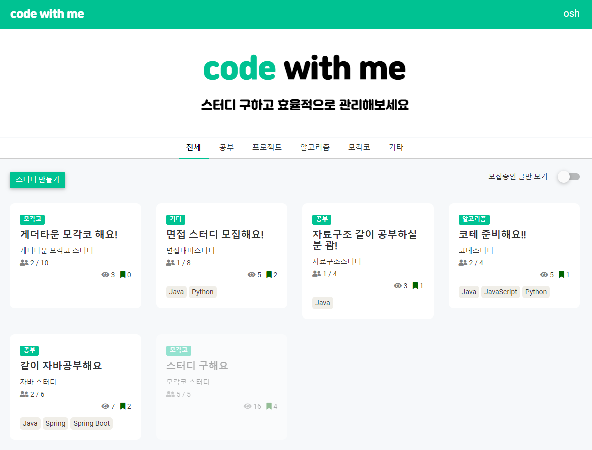
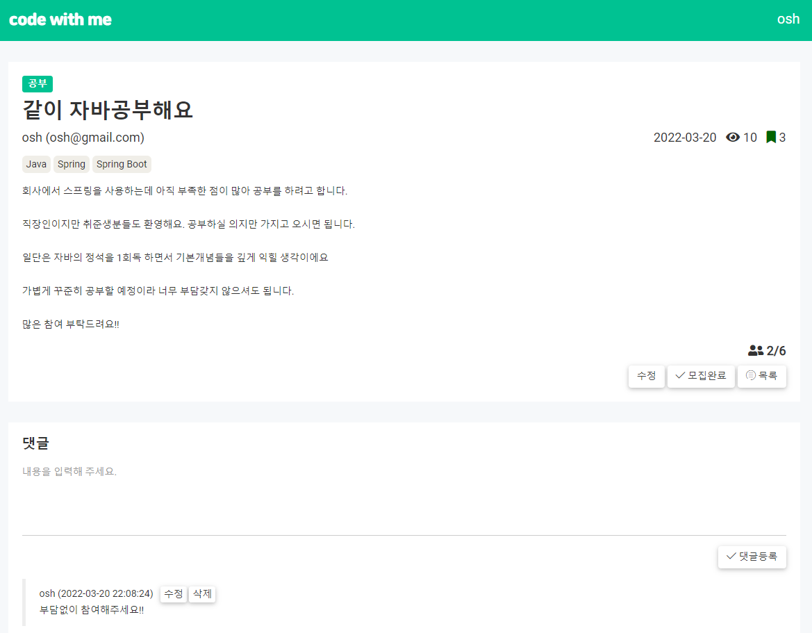
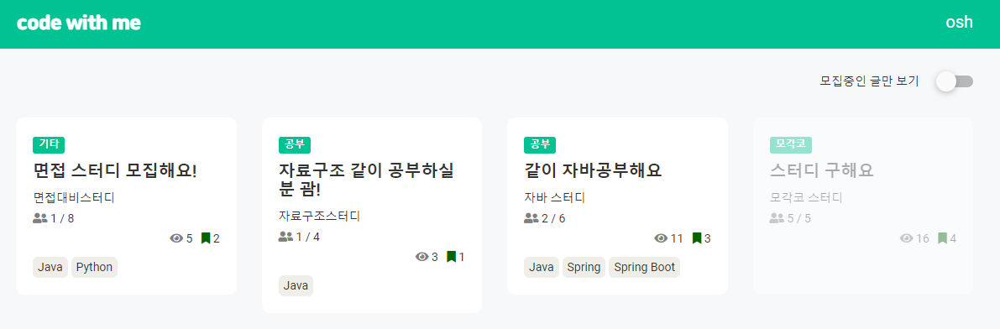
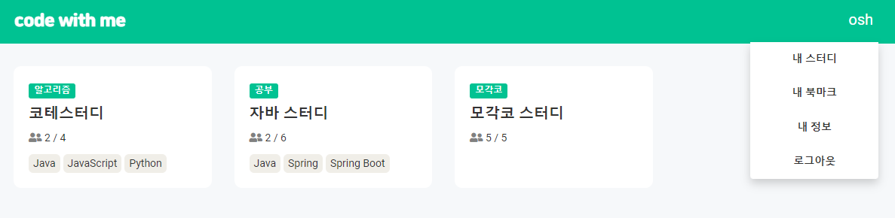
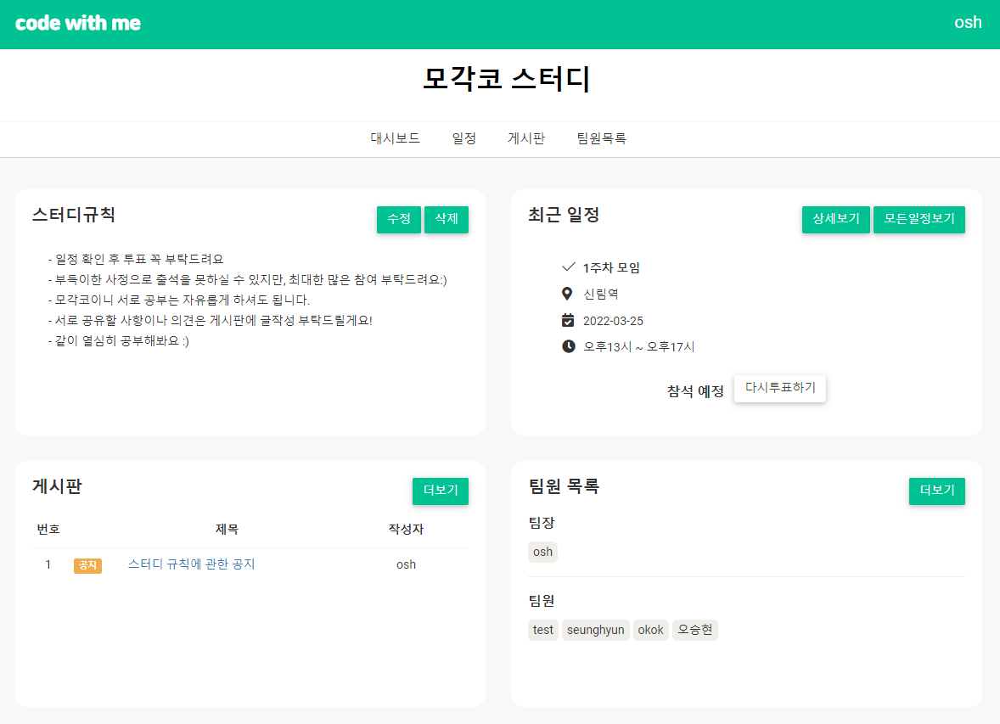
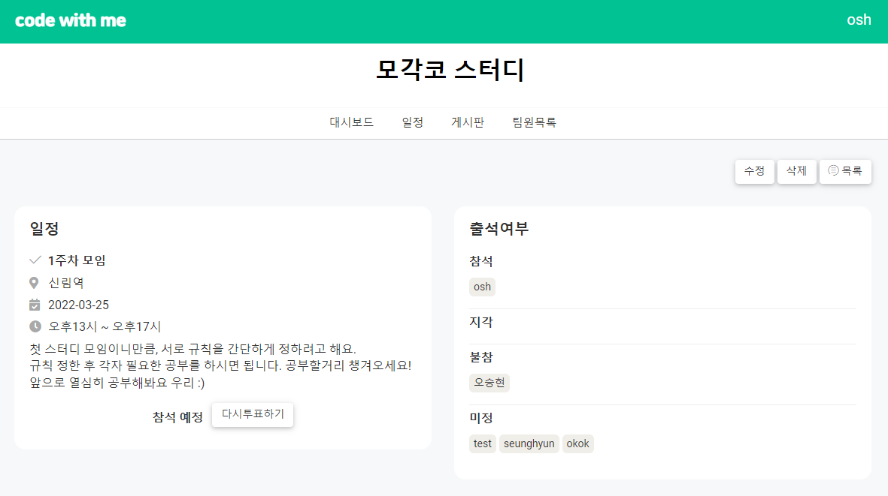
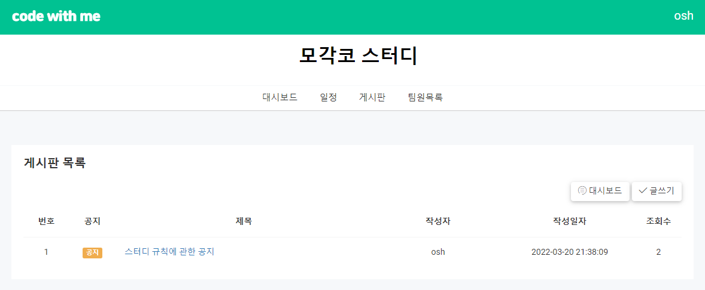
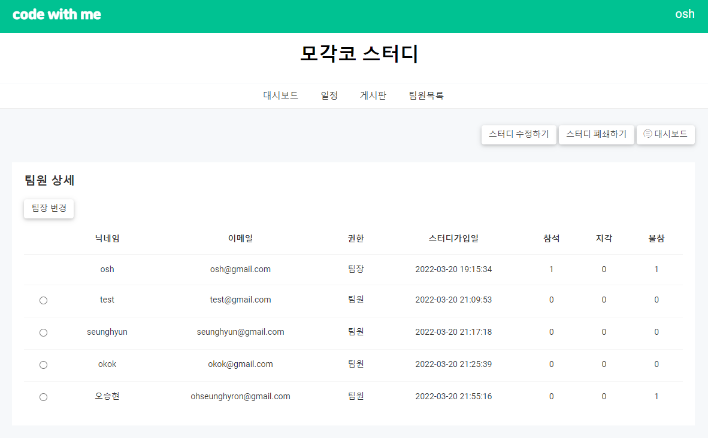

# 프로젝트 소개

### ***[code with me 보러가기](http://codewithme.site/)***

> 스터디그룹 모집 / 관리 서비스 프로젝트
> 

## 개발기간

- 2022.02.16 ~ 2022.03.18
- 계속해서 기능 추가 예정

## 주요 기술 스택

- Node.js, Express, MySQL, AWS Light sail, Git 사용

## 주요 기능 소개

### [스터디 모집]

### 1. 메인화면 - 스터디 모집글 목록

- 토글버튼 사용해서 모집중인 글만 보기 / 모집중, 모집완료 된 글 모두 보기 선택 가능
- 공부, 프로젝트, 알고리즘, 모각코, 기타 별로 카테고리를 나누어, 원하는 종류의 글만 볼수 있게 선택 가능

### 2. 스터디 모집글 상세

- 스터디 등록, 수정, 모집완료, 북마크 기능
- 댓글 등록, 수정, 삭제 기능

### 3. 내 북마크 / 내 스터디 목록

- 사용자가 참여중인 스터디 목록 조회

- 사용자가 북마크한 스터디 모집글 목록 조회
- 해당 스터디 클릭시 스터디 관리 페이지 대시보드로 이동

### [스터디 관리]

### 1. 대시보드 화면

- 스터디 규칙 조회
- 해당 사용자 권한이 팀장일시 스터디 규칙 등록, 수정, 삭제 가능
- 최근일정1건 조회 및 투표기능. 투표 후 다시 투표 수정 가능
- 게시글 최근4건 조회
- 팀원목록 팀장 / 팀원 별로 조회

### 2. 일정

- 지난 일정 포함 일정 목록 조회
- 일정 상세내용 조회 및 투표 기능
- 각 팀원별로 출석여부 조회
- 일정 등록 / 수정 / 삭제 기능

### 3. 게시판

- 게시판 글 목록 조회
- 게시판 글 등록 / 수정 / 삭제 기능
- 해당 사용자 권한이 팀장일시 공지글을 작성 가능

### 4. 팀원 상세

- 팀원 정보, 출결상태 상세하게 조회
- 해당 사용자 권한이 팀장일시 팀장 변경, 스터디 수정, 폐쇄 가능
- 해당 사용자 권한이 팀원일시 스터디 탈퇴 가능

## 저작권 및 사용권 정보

부트스트랩 템플릿 - [https://themewagon.com/themes/free-bootstrap-admin-dashboard-template-notika/](https://themewagon.com/themes/free-bootstrap-admin-dashboard-template-notika/)

아이콘 - [https://fontawesome.com/](https://fontawesome.com/)
